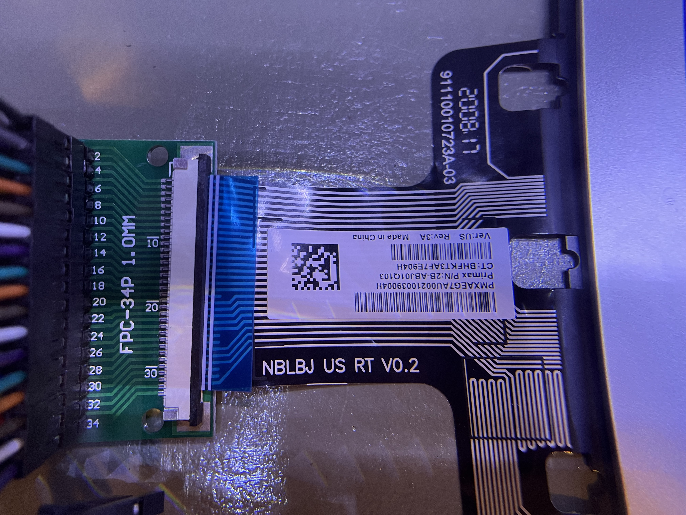
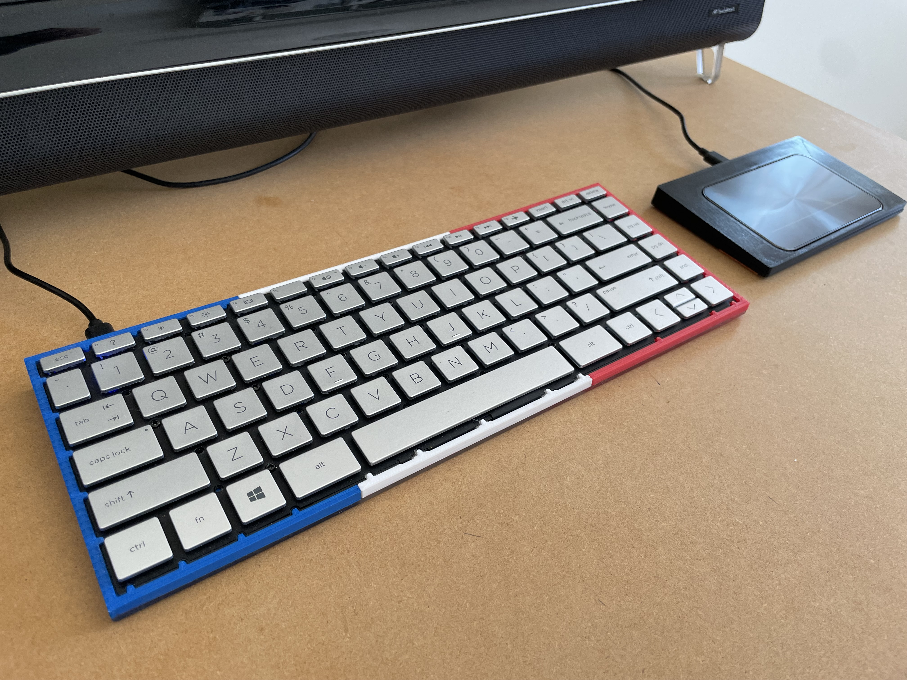

# HP Pavilion x360 keyboard reuse project

I found this laptop keyboard (Model: NBLBJ US RT V0.2) in an e-waste bin. Searches on Google suggest that it's from a Pavilion x360 laptop. The goal is to make a standalone USB keyboard out of it.

Its physical interface is a 1 mm pitch 32-pin FCP. I purchased a few 34-pin (the closest to 32 I could find) connectors from aliexpress, planning to use one for breadboard prototyping and one for the final product.



## Determining matrix
### Basic concepts
Laptop keyboards are simple, at least all the ones I have seen. They are passive parts. I.e. there's no chip in them. They have a set of wires. When a key is pressed, two of the wires are shorted. And that's all there is to it.

Unlike USB keyboards, they need a driver or a chip from the laptop that knows how to scan it. The wires are divided into two groups, rows and columns. Each key is connected to one row wire and one column wire. When pressed, these two wires are connected. The driver *scans* the wires at a high frequency, pulling each row high sequentially, and read all the columns. If a key is pressed, its corresponding column will read high when its row is pulled high. This way, the driver can determine which key is pressed. Of course, the driver can also reverse the logic and pull the rows low if their normal state is high. It can also by writing the columns and reading the rows.

Note that the terms of *row* and *column* has nothing to do with the physical layout. In fact, they usually don't resemble the physical layout at all. The reason is that laptop keyboards don't have a PCB per se. All the wires are laid out in one layer. I.e. no two wires can cross each other. This makes laying out the wires quite challenging. If you're into mechanical keyboards, you have probably noticed that the rows and columns of a mechanical keyboard more or less reflect the physical layout. That is because they have two sides of a PCB to work with, making wire crossing possible. 

Also, laptop keyboards lack diodes which are found in mechanical keyboards. So, anti-ghosting can only be achieved by using a sparse matrix. This, combined with the layout challenge, means that there are usually much more wires in a laptop keyboard than mechanical keyboards although they work very similarly. In particular, this 84-key keyboard uses 23 wires. A typical 75% mechanical keyboard would have 19 (9x10 = 90) or at most 20. Even with this many more wires, it's not possible to completely avoid ghosting. But the designer usually strategically assign the rows and columns such that ghosting only happens in key combos that don't normally occur during normal usage. Thus, these keybaords are normally not suitable for gaming.

To decode the matrix (i.e. which key corresponds to which column and row), I used MCU to revserse engineer it semi programmatically. The end goal is to figure out:

* Which pins are columns
* Which pins are rows
* Which pins are unused
* The column and row of each key

### Algorithm

The algorithm for determining the matrix is simple. I connect all wires to a microcontroller's GPIO pins. Then I iterate through all these pins, pulling one pin low at a time, leaving all other pins pulled up. Then I read all other pins. If any of them is low, it must be connected to the first pin via a key. So I output those two pins on the seraial console. The program runs indefinitely. I press the keys one by one and manually write down the corresponding wires on a sheet of paper.

I used a [WROOM ESP32](https://www.espressif.com/en/products/modules/esp32). But pretty much any MCU will do, as long as it has enough pins. If you don't have enough pins, there are a few options. One is to use an I/O expander. Another is to do it in a few passes.

### Code
```
#include <Arduino.h>

const int pins = 32;
int gpio[pins] = {...}; // GPIO pin numbers for all the wires

void setup() {
  Serial.begin(115200);
  Serial.println("Starting to scan...");
  delay(200);
}

void loop() {
  for (int i = 0; i < pins; i ++) {
    pinMode(gpio[i], OUTPUT);
    digitalWrite(gpio[i], LOW);
    for (int j = i + 1; j < pins; j ++) {
      pinMode(gpio[j], INPUT_PULLUP);
      int value = digitalRead(gpio[j]);
      if (value == LOW) {
        Serial.print(i + 1);
        Serial.print(" - ");
        Serial.print(j + 1);
        Serial.println();
      }
    }
    digitalWrite(gpio[i], HIGH);
  }
  delay(100);
}
```

### Assigning rows and columns
Next, I divide the wires into two sets: rows and columns. Each key is associated with one row and one column.  Essentially, this is a [bigraph](https://en.wikipedia.org/wiki/Bipartite_graph) algorithm. Each wire is a vertex and each key is an edge connecting two vertices. All edges are between rows and columns. There's no edge within rows or columns. One can write a program to do this. But I just did it manually.

* First, assign one wire to the row set. This is completely arbitray.
* For each wire in the row set, iterate through its edges, assigning the other end of each edge to the column set.
* Do the same for the column set.
* Repeat the previous two steps untill all wires are assigned.

Here's the result.

Columns:  
```
Col #: 0 1 2 3 4 5 6 7  
Pin #: 1 2 3 5 6 8 9 12
```

Rows:  
```
Row #:  0  1  2  3  4  5  6  7  8  9 10 11 12 13 14  
Pin #: 11  7 10  4 13 14 16 17 18 20 21 22 23 24 15
```

In total, there are 23 pins used for the matrix. The rest of the pins are either not used or for the capslock indicator. I couldn't figure out the pins for the indicator despite having tried all the combinations using a multimeter. It might be broken.

```
   |   0   |   1   |   2   |   3   |   4   |   5   |   6   |   7   |
---+-------+-------+-------+-------+-------+-------+-------+-------+
 0 | ESC   | Q     | 1     | A     | Z     | Tab   | `     | Caps  |
 1 |       |       |       | RCtrl |       | LCtrl |       |       |
 2 | F7    | W     | 2     | S     | X     | F6    | F5    | F8    |
 3 |       | RShft |       |       | LShft |       |       |       |
 4 | F4    | E     | 3     | D     | C     | F3    | F2    | F1    |
 5 | G     | R     | 4     | F     | V     | T     | 5     | B     |
 6 | H     | U     | 7     | J     | M     | Y     | 6     | N     |
 7 |       | I     | 8     | K     | ,     | ]     |       |       |
 8 | Win   |       |       |       |       |       |       |       |
 9 |       |       | LAlt  |       |       |       |       | RAlt  |
10 | BkSpc | Up    | Down  | Entr  | Spc   |       | \     | PrtSc |
11 | F11   | O     | 9     | L     | .     | F10   | F9    | F12   |
12 | '     | P     | 0     | ;     | /     | [     | -     | =     |
13 | INS   | Left  | Right | PgDn  | End   | Home  | PgUp  | Del   |
14 |       |       |       |       |       |       | Fn    |       |    
---+-------+-------+-------+-------+-------+-------+-------+-------+
```

## Build the firmware
The next step is to hook it up with an MCU and run QMK on it. I happen to have a spare Elite-C which has 24 exposed pins, perfect for this job. I can even use the last pin for a caps lock LED.

I don't need anything fancy. So I just need a basic keybaord definition. QMK's build system makes it really easy. Here's the full definition in json format.

```
{
    "keyboard_name": "Pavilion x360",
    "manufacturer": "HP",
    "maintainer": "delingren",
    "bootloader": "atmel-dfu",
    "diode_direction": "COL2ROW",
    "matrix_pins": {
        "cols": ["D3", "D2", "D1", "D4", "C6", "E6", "B4", "D5"],
        "rows": ["B7", "D7", "B5", "D0", "F1", "F0", "B2", "B3", "B1", "F7", "F6", "F5", "F4", "B0", "B6"]
    },
    "indicators": {
        "caps_lock": "C7",
        "on_state": 1
    },
    "processor": "atmega32u4",
    "url": "",
    "usb": {
        "vid": "0x7280",
        "pid": "0x6882",
        "device_version": "0.0.1"
    },
    "features": {
        "extrakey": true,
        "bootmagic": true
    },
    "layouts": {
        "LAYOUT_ansi": {
            "layout": [
                {"matrix": [0, 0], "x": 0, "y": 0, "label": "ESC"},
                {"matrix": [4, 7], "x": 0, "y": 0, "label": "F1"},
                {"matrix": [4, 6], "x": 0, "y": 0, "label": "F2"},
                {"matrix": [4, 5], "x": 0, "y": 0, "label": "F3"},
                {"matrix": [4, 0], "x": 0, "y": 0, "label": "F4"},
                {"matrix": [2, 6], "x": 0, "y": 0, "label": "F5"},
                {"matrix": [2, 5], "x": 0, "y": 0, "label": "F6"},
                {"matrix": [2, 0], "x": 0, "y": 0, "label": "F7"},
                {"matrix": [2, 7], "x": 0, "y": 0, "label": "F8"},
                {"matrix": [11, 6], "x": 0, "y": 0, "label": "F9"},
                {"matrix": [11, 5], "x": 0, "y": 0, "label": "F10"},
                {"matrix": [11, 0], "x": 0, "y": 0, "label": "F11"},
                {"matrix": [11, 7], "x": 0, "y": 0, "label": "F12"},
                {"matrix": [13, 0], "x": 0, "y": 0, "label": "Ins"},
                {"matrix": [10, 7], "x": 0, "y": 0, "label": "PrtSc"},
                {"matrix": [13, 7], "x": 0, "y": 0, "label": "Del"},

                {"matrix": [0, 6], "x": 0, "y": 0, "label": "`"},
                {"matrix": [0, 2], "x": 0, "y": 0, "label": "1"},
                {"matrix": [2, 2], "x": 0, "y": 0, "label": "2"},
                {"matrix": [4, 2], "x": 0, "y": 0, "label": "3"},
                {"matrix": [5, 2], "x": 0, "y": 0, "label": "4"},
                {"matrix": [5, 6], "x": 0, "y": 0, "label": "5"},
                {"matrix": [6, 6], "x": 0, "y": 0, "label": "6"},
                {"matrix": [6, 2], "x": 0, "y": 0, "label": "7"},
                {"matrix": [7, 2], "x": 0, "y": 0, "label": "8"},
                {"matrix": [11, 2], "x": 0, "y": 0, "label": "9"},
                {"matrix": [12, 2], "x": 0, "y": 0, "label": "0"},
                {"matrix": [12, 6], "x": 0, "y": 0, "label": "-"},
                {"matrix": [12, 7], "x": 0, "y": 0, "label": "="},
                {"matrix": [10, 0], "x": 0, "y": 0, "label": "Backspace"},
                {"matrix": [13, 5], "x": 0, "y": 0, "label": "Home"},

                {"matrix": [0, 5], "x": 0, "y": 0, "label": "Tab"},
                {"matrix": [0, 1], "x": 0, "y": 0, "label": "Q"},
                {"matrix": [2, 1], "x": 0, "y": 0, "label": "W"},
                {"matrix": [4, 1], "x": 0, "y": 0, "label": "E"},
                {"matrix": [5, 1], "x": 0, "y": 0, "label": "R"},
                {"matrix": [5, 5], "x": 0, "y": 0, "label": "T"},
                {"matrix": [6, 5], "x": 0, "y": 0, "label": "Y"},
                {"matrix": [6, 1], "x": 0, "y": 0, "label": "U"},
                {"matrix": [7, 1], "x": 0, "y": 0, "label": "I"},
                {"matrix": [11, 1], "x": 0, "y": 0, "label": "O"},
                {"matrix": [12, 1], "x": 0, "y": 0, "label": "P"},
                {"matrix": [12, 5], "x": 0, "y": 0, "label": "["},
                {"matrix": [7, 5], "x": 0, "y": 0, "label": "]"},
                {"matrix": [10, 6], "x": 0, "y": 0, "label": "\\"},
                {"matrix": [13, 6], "x": 0, "y": 0, "label": "PgUp"},

                
                {"matrix": [0, 7], "x": 0, "y": 0, "label": "Caps"},
                {"matrix": [0, 3], "x": 0, "y": 0, "label": "A"},
                {"matrix": [2, 3], "x": 0, "y": 0, "label": "S"},
                {"matrix": [4, 3], "x": 0, "y": 0, "label": "D"},
                {"matrix": [5, 3], "x": 0, "y": 0, "label": "F"},
                {"matrix": [5, 0], "x": 0, "y": 0, "label": "G"},
                {"matrix": [6, 0], "x": 0, "y": 0, "label": "H"},
                {"matrix": [6, 3], "x": 0, "y": 0, "label": "J"},
                {"matrix": [7, 3], "x": 0, "y": 0, "label": "K"},
                {"matrix": [11, 3], "x": 0, "y": 0, "label": "L"},
                {"matrix": [12, 3], "x": 0, "y": 0, "label": ";"},
                {"matrix": [12, 0], "x": 0, "y": 0, "label": "'"},
                {"matrix": [10, 3], "x": 0, "y": 0, "label": "Enter"},
                {"matrix": [13, 3], "x": 0, "y": 0, "label": "PgDn"},
                
                {"matrix": [3, 4], "x": 0, "y": 0, "label": "L Shift"},
                {"matrix": [0, 4], "x": 0, "y": 0, "label": "Z"},
                {"matrix": [2, 4], "x": 0, "y": 0, "label": "X"},                
                {"matrix": [4, 4], "x": 0, "y": 0, "label": "C"},
                {"matrix": [5, 4], "x": 0, "y": 0, "label": "V"},
                {"matrix": [5, 7], "x": 0, "y": 0, "label": "B"},
                {"matrix": [6, 7], "x": 0, "y": 0, "label": "N"},
                {"matrix": [6, 4], "x": 0, "y": 0, "label": "M"},
                {"matrix": [7, 4], "x": 0, "y": 0, "label": ","},
                {"matrix": [11, 4], "x": 0, "y": 0, "label": "."},
                {"matrix": [12, 4], "x": 0, "y": 0, "label": "/"},
                {"matrix": [3, 1], "x": 0, "y": 0, "label": "R Shift"},
                {"matrix": [13, 4], "x": 0, "y": 0, "label": "End"},
                
                {"matrix": [1, 5], "x": 0, "y": 0, "label": "L Ctrl"},
                {"matrix": [14, 6], "x": 0, "y": 0, "label": "Fn"}
                {"matrix": [8, 0], "x": 0, "y": 0, "label": "Win"},
                {"matrix": [9, 2], "x": 0, "y": 0, "label": "L Alt"},
                {"matrix": [10, 4], "x": 0, "y": 0, "label": "Space"},
                {"matrix": [9, 7], "x": 0, "y": 0, "label": "R Alt"},
                {"matrix": [1, 3], "x": 0, "y": 0, "label": "R Ctrl"},
                {"matrix": [13, 1], "x": 0, "y": 0, "label": "Left"},
                {"matrix": [10, 2], "x": 0, "y": 0, "label": "Down"},
                {"matrix": [10, 1], "x": 0, "y": 0, "label": "Up"},                
                {"matrix": [13, 2], "x": 0, "y": 0, "label": "Right"}
            ]
        }
    }
}

```

## Keyboard case
I designed a case for it with Fusion 360 and 3D printed it. The f3d and stil files can be found in the repo. Since I don't have a printer big enough to print the whole case, I split it into 3 pieces. They are locked together using screws and threaded inserts. The bottom is a piece of plexiglass. Since I needed to split up, I decided to use French flag colors. Not that I have any relation with France. I just thought the colors looked nice.

